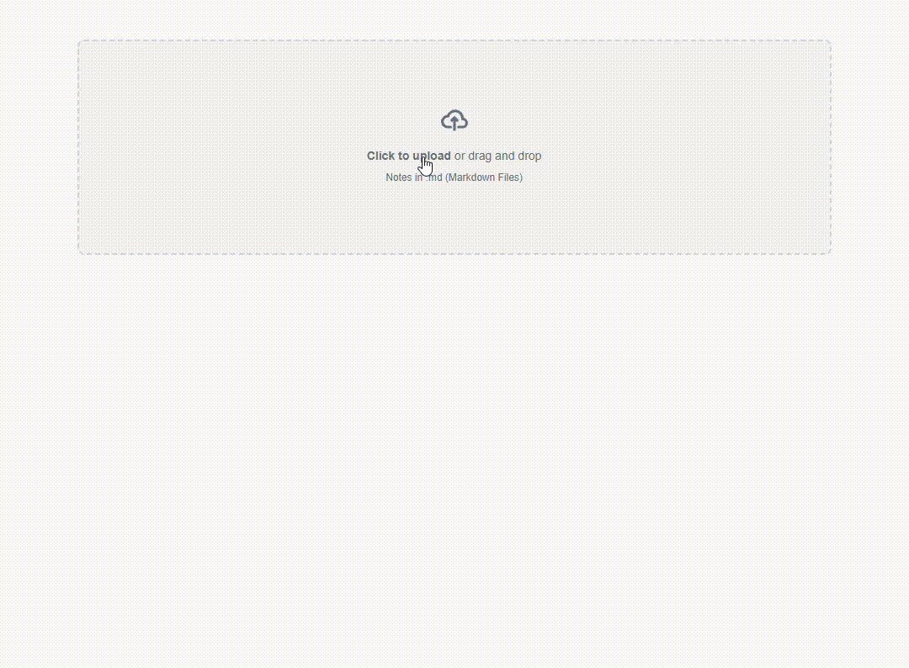

# Flashcard Project

Welcome to the Flashcard Project! This project allows users to upload Markdown files, generate flashcards, and download the generated flashcards as a CSV file.



## Table of Contents

- [Flashcard Project](#flashcard-project)
  - [Table of Contents](#table-of-contents)
  - [Introduction](#introduction)
  - [Installation](#installation)
  - [Usage](#usage)

## Introduction

The Flashcard Project is a web application that helps users create flashcards from Markdown files. Users can upload a Markdown file, generate flashcards, and download the flashcards as a CSV file for easy use in other applications.

## Installation

To get started with the Flashcard Project, follow these steps:

1. Clone the repository:
    ```sh
    git clone https://github.com/keanteng/flashcard
    ```
2. Navigate to the project directory:
    ```sh
    cd flashcard-project
    ```
3. Install the dependencies:
    ```sh
    npm install
    ```
4. Start the development server:
    ```sh
    npm run dev
    ```

## Usage

Follow these steps to use the Flashcard Project:

1. Upload a Markdown file using the dropzone.
2. Click the "Generate Flashcards" button to generate flashcards.
3. Download the generated flashcards as a CSV file.